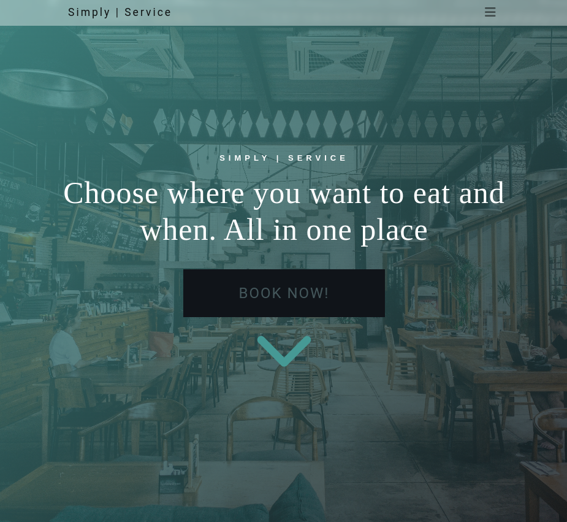

# Simply | Service

Simply Service is a hospitality app designed to be the one stop shop for restaurants and customers to combat the use of individual booking systems and websites of restaurants. This is my portfolio project 4 for Code Institutes full stack diploma.

[Link to Simply | Service](https://simply-service.herokuapp.com/)

# UX

# The Stratagy Plane

## Agile Planning

This project has been approached with an Agile mindset. Using epics, tasks and user stories. I have laid out not only what I plan to achieve with this website but what I expect users hitting the home page will want. This approach has helped to compartmentalize development and make what I hope to achieve much more manageable. 

This can be seen implemented on my projects [Kanban.](https://github.com/users/EeeBeeDee/projects/3/views/1)

## Epics and Tasks

The First 6 Epics are essential and the minimum needed to deliver the basic application so their tasks were prioritized with any following epics designated as extras with descending priority.

### **Epic 1: Project Initialization & Deployment**

This includes the initial project setup, installing the framework, dependencies and libraries. Setting up ElephantSQL. Configuring our settings.py file and Heroku Application so that everything is connected and running on the live site as early as possible.

---

### **Epic 2: Databases & Migration**

This includes the model setup for the booking system and general connection to the DB.  Any extra apps will have their model set up included with them. 

---

### **Epic 3: Bookings**

With the model already set up this included the booking form creation and views creation, making sure post and get requests worked as intended and information was retrieved in a parsable way.

---

### **Epic 4: Front End Design**

With the back end functionality in place this epic included all design and front end functionality. Making information easily accessible.

---

### **Epic 5: Responsiveness** 

As Bootstrap was used fairly extensively, not many media queries were needed to facilitate a responsive design and this epic ended up being a lot smaller than I had imagined when planning the site.

---

### **Epic 6: Documentation and Testing**

Create both my TESTING.md and this README.md to document the creation and implementation to this project.

---

## **Non Essential Epics**

### **Epic 7: User Accounts**

User accounts have been extended slightly to allow for email and phone numbers to be taken on registration and then used to autopopulate the bookings form. My plan was for more extension to the model and to use it for the creation of user generated restaurants. 

Extending the user profile while using django-allauth turned out to be fairly cumbersome and lacking in documentation so due to time constraints I didn't fully realize this feature.

---

### **Epic 9: Unique Error Pages**

Low down the list but easy to implement I added unique 404 and 500 error pages. Although this was only realistically one task I added this as an epic as it was something I had never done and contained a bit of both front end and django work. 

---

## **Unresolved Epics**

### **Epic 8: Restaurant Creation**

Something planned for the future I will 100% add in my own time but having two types of accounts. One for customers and restaurants and then another DB model for restaurants was just too much to attempt while first getting my head around django.

---

## Skeleton Plane

### Wireframes 

Using [Balsamiq](https://balsamiq.com/wireframes/) I created the skeleton and initial layout.

### Schema

## Scope Plane

- Landing page which conveys what the website is used for.
- Allow a user to create an account which will then allow them to make, update and delete bookings.
- Make sure the website is functional and presentable in all formats and screen sizes.

## Structure Plane 

### Features

#### Navbar

Navbar was designed with the glass and 'clean' motif I had planned for the website, it features throughout the website and is responsive due to bootstrap stylings.

Options available change depending on the logged in status of the user.

#### Hero/Landing 

### Design 

#### Colour pallette 

I knew I wanted a light blue teal as the main colour throughout. Then instead of just a pure black the off black I have included contains a hint of blue. As a tertiary I thought having a unique colour for the usual error and delete red that I could use in other places too without having too many colors. Another "Colour" used throughout is a white with an alpha value of less than 1 with a blur effect added to give of a glassy feel.

#### Typography 

For typography I decided to go for a singular font from [Google Fonts](https://fonts.google.com) called [Wix Madefor Display](https://fonts.google.com/specimen/Wix+Madefor+Display). After trying a few out I felt it meshes well with the soft, rounded feel I have aimed for with the design. 

# Technologies Used

### Languages and Frameworks Used

-   [HTML5](https://en.wikipedia.org/wiki/HTML5)
-   [CSS3](https://en.wikipedia.org/wiki/Cascading_Style_Sheets)
-   [Javascript](https://en.wikipedia.org/wiki/JavaScript)
-   [Python3](https://www.python.org/)
-   [Django](https://www.djangoproject.com/)

### Libraries and Django Plugins Used
- [Font Awesome:](https://fontawesome.com/)
    - Font Awesome was used for the chevron arrows used for navigation through the site
- [Bootstrap:](https://getbootstrap.com/)
    - Bootstrap was used manly for formatting, positioning and responsive design throughout the project.
- [JQuery:](https://jquery.com/)
    - Used very lightly as not much JS was needed in the final version of the website.
- [Django-Allauth:](https://django-allauth.readthedocs.io/en/latest/index.html)
    - Used to control user profile functionality.

### Tools Used

- [VScode](https://code.visualstudio.com/)
    - Vscode was my code editor for this project.
- [Git](https://git-scm.com/)
    - Git was used for version control and to Push to GitHub.
- [GitHub:](https://github.com/)
    - GitHub is used to store the project's code remotely and then to host the static website on GitHub Pages.
- [Heroku:](https://signup.heroku.com/login)
    - Heroku is where the app is hosted online.
- [ElephantSQL:](https://www.elephantsql.com/)
    - ElephantSQL is where the database is hosted
- [Cloudinary:](https://cloudinary.com/)
    - Cloudinary is connected to the project but not fully utilized due to time constraints, future plans are to have it host pictures restaurants can use for their own generated 

### Linters used 

-   [W3C - HTML](https://validator.w3.org/)
-   [Jigsaw - CSS](https://jigsaw.w3.org/css-validator/)
-   [JSHint - JS](https://jshint.com/)
-   [PEP8CI - Python](https://pep8ci.herokuapp.com/)

# Deployment

### Local Deployment

In order to make a local copy of this project, you can clone it. In your IDE Terminal, type the following command to clone my repository:

- `git clone https://github.com/EeeBeeDee/simply-service.git`

Alternatively, if using Gitpod, you can click below to create your own workspace using this repository.

### Remote Deployment

These steps can be taken to deploy the cloned site from above to [Heroku](https://signup.heroku.com/login):

- Create an account with [Heroku](https://signup.heroku.com/login).
- Once on your Dashboard select "New" first followed by "Create a new app".
- Create a unique name for the app. It must be unique as it will be used for the applications URL.
- Once created you will see a "Settings" button at the end of this apps dashboards navbar.
- Find the config Vars you will have to create key value pairs that match up with your settings.py file. I suggest using an env.py file which you include in your .gitignore file. A good guide on how to do so can be found [here.](https://www.twilio.com/blog/environment-variables-python)
- Your key value pairs should look like this:
    - SECRET_KEY: The Secret Key for your project, this can be anything you choose.
    - DATABASE_URL: The URL from your ElephantSQL dashboard. Use the [ElephantSQL Docs](https://www.elephantsql.com/docs/index.html) if you are not sure how.
    - CLOUNDINARY_URL: The URL from your Cloudinary account.
- Then navigate to "Deploy". 
- Use the connect to github button then search for the correct repo then select which branch is to be deployed, most likely main by default.

# Testing

All Testing is documented separately in the [TESTING.md](/TESTING.md) file.

# Credits

- [Login mixin for classes](https://stackoverflow.com/questions/72602785/django-attributeerror-function-object-has-no-attribute-as-view-showing-in)
- [Understanding reverses](https://stackoverflow.com/questions/11241668/what-is-reverse)
- [Update and edit databases](https://www.youtube.com/watch?v=jCM-m_3Ysqk)
- [Net Ninja in general but this one in particular linking forms to model and frontend](https://www.youtube.com/watch?v=jBGmqxpw0V8)
- [Go directly to a section of a page with a django link](https://stackoverflow.com/questions/55055523/how-to-configure-django-url-to-point-to-a-specific-section-in-the-page)
- [Update form instances](https://www.youtube.com/watch?v=jCM-m_3Ysqk)
- [Help customizing all auth forms and models](https://dev.to/gajesh/the-complete-django-allauth-guide-la3)